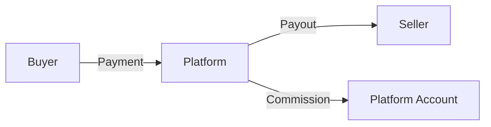
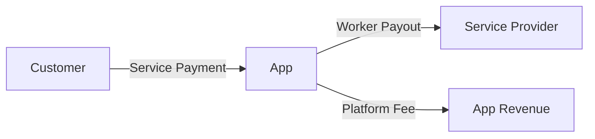

## Overview

Interac e-Transfer integration allows you to both collect payments from customers and send payouts to recipients. This guide provides an overview of both functionalities and directs you to specific implementation details.

## e-Transfer Options

<CardGroup cols={2}>
  <Card
    title="e-Transfer Payment"
    icon="money-bill-transfer"
    href="/user-guides/etransfer-payment"
  >
    Accept payments from customers via Interac e-Transfer. Perfect for B2C transactions.
  </Card>
  <Card
    title="e-Transfer Payout"
    icon="money-bill-wave"
    href="/user-guides/etransfer-payout"
  >
    Send payments to recipients via Interac e-Transfer. Ideal for disbursements and payroll.
  </Card>
</CardGroup>

## Key Benefits

### For Payments
- **Familiar Process**: Customers use their existing banking apps
- **No Credit Cards**: No need for credit card processing
- **Direct Bank Transfer**: Funds come directly from customer's bank account
- **Email-Based**: Simple email notification system

### For Payouts
- **Instant Delivery**: Recipients get email notifications immediately
- **Secure**: Built-in security questions and auto-deposit options
- **Flexible**: Support for scheduled and bulk payouts
- **Trackable**: Real-time status updates via webhooks

## Integration Comparison

| Feature | e-Transfer Payment | e-Transfer Payout |
|---------|-------------------|-------------------|
| **Direction** | Customer → Your Business | Your Business → Recipient |
| **Use Case** | Collecting payments | Sending disbursements |
| **Email Recipient** | Customer receives instructions | Recipient receives transfer |
| **Processing Time** | 1-3 business days | 1-3 business days |
| **Security** | Standard Interac security | Optional security questions |
| **Webhooks** | Payment status updates | Payout status updates |

## Getting Started

### 1. Choose Your Integration Type

<Tabs>
  <Tab title="Accepting Payments">
    If you need to collect money from customers:
    
    - E-commerce checkouts
    - Invoice payments
    - Service payments
    - Subscription renewals
    
    → **Use [e-Transfer Payment](/user-guides/etransfer-payment)**
  </Tab>
  
  <Tab title="Sending Payouts">
    If you need to send money to recipients:
    
    - Vendor payments
    - Employee reimbursements
    - Affiliate commissions
    - Refunds and returns
    
    → **Use [e-Transfer Payout](/user-guides/etransfer-payout)**
  </Tab>
  
  <Tab title="Both Directions">
    Many businesses need both capabilities:
    
    - Marketplaces (collect from buyers, pay sellers)
    - Gig economy platforms
    - Financial services
    - Multi-sided platforms
    
    → **Implement both integrations**
  </Tab>
</Tabs>

### 2. Authentication Setup

Both e-Transfer types use the same authentication method:

```bash
Authorization: Bearer YOUR_API_TOKEN
```

<Card title="Get Your API Keys" icon="key" href="/api-reference/authentication">
  Set up your authentication credentials for both sandbox and production environments
</Card>

### 3. Webhook Configuration

Configure webhooks to receive real-time updates:

<CardGroup cols={2}>
  <Card title="Payment Webhooks" icon="webhook">
    - `etransfer.payment.created`
    - `etransfer.payment.completed`
    - `etransfer.payment.failed`
    - `etransfer.payment.expired`
  </Card>
  <Card title="Payout Webhooks" icon="webhook">
    - `etransfer.payout.created`
    - `etransfer.payout.sent`
    - `etransfer.payout.completed`
    - `etransfer.payout.failed`
  </Card>
</CardGroup>

## API Endpoints Quick Reference

### e-Transfer Payment
```bash
POST https://api.payper.ca/v1/etransfer/payment
GET  https://api.payper.ca/v1/etransfer/payment/{id}
```

### e-Transfer Payout
```bash
POST https://api.payper.ca/v1/etransfer/payout
GET  https://api.payper.ca/v1/etransfer/payout/{id}
POST https://api.payper.ca/v1/etransfer/payout/bulk
```

## Testing Environment

Both payment and payout functionality can be tested in our sandbox:

<CardGroup cols={2}>
  <Card title="Sandbox Payments" icon="flask">
    ```
    POST https://sandbox-api.payper.ca/v1/etransfer/payment
    ```
    Test customer payment flows
  </Card>
  <Card title="Sandbox Payouts" icon="flask">
    ```
    POST https://sandbox-api.payper.ca/v1/etransfer/payout
    ```
    Test recipient payout flows
  </Card>
</CardGroup>

### Test Email Addresses

Use these special email addresses in sandbox for predictable test results:

| Email | Payment Behavior | Payout Behavior |
|-------|------------------|-----------------|
| `success@payper.ca` | Always completes | Always accepts |
| `fail@payper.ca` | Always fails | Always fails |
| `expire@payper.ca` | Always expires | Always expires |

## Security Best Practices

<CardGroup cols={2}>
  <Card title="API Security" icon="shield">
    - Store API keys securely
    - Use HTTPS for all requests
    - Implement proper authentication
    - Validate webhook signatures
  </Card>
  <Card title="Data Protection" icon="lock">
    - Encrypt sensitive data
    - Follow PCI compliance
    - Secure logging practices
    - Regular security audits
  </Card>
</CardGroup>

## Common Integration Patterns

### Marketplace Platform



1. Buyer pays platform via e-Transfer Payment
2. Platform pays seller via e-Transfer Payout
3. Platform retains commission

### Gig Economy App



1. Customer pays for service via e-Transfer Payment
2. App pays worker via e-Transfer Payout
3. App retains platform fee

## Next Steps

<CardGroup cols={2}>
  <Card
    title="e-Transfer Payment Guide"
    icon="money-bill-transfer"
    href="/user-guides/etransfer-payment"
  >
    Learn how to accept payments from customers
  </Card>
  <Card
    title="e-Transfer Payout Guide"
    icon="money-bill-wave"
    href="/user-guides/etransfer-payout"
  >
    Learn how to send payments to recipients
  </Card>
  <Card
    title="API Reference"
    icon="code"
    href="/api-reference/introduction"
  >
    Explore the complete API documentation
  </Card>
  <Card
    title="Dashboard"
    icon="chart-line"
    href="https://sandbox.dashboard.payper.ca/login/"
  >
    Monitor and manage your transactions
  </Card>
</CardGroup>

## Support

<Note>
  Need help with your e-Transfer integration? Our technical team is ready to assist you with both payment and payout implementations.
</Note>

- **Technical Support**: [technical@payper.ca](mailto:technical@payper.ca)
- **API Documentation**: [Complete API Reference](/api-reference/introduction)
- **Dashboard**: [Transaction Management](https://sandbox.dashboard.payper.ca/login/) 