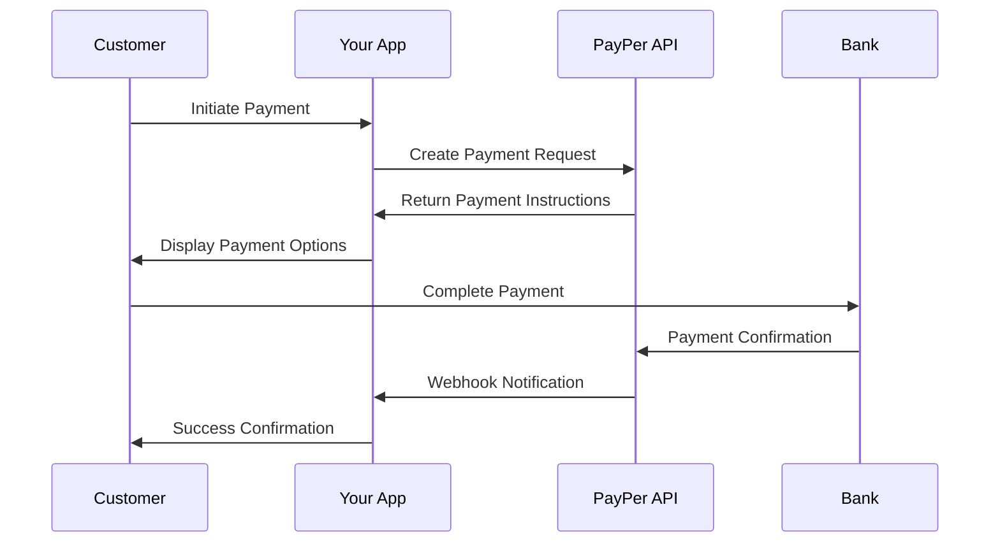
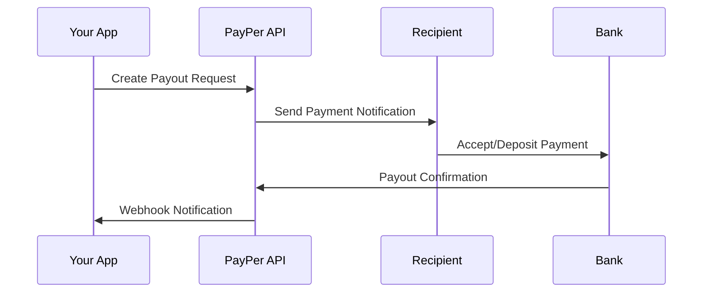

## Welcome to PayPer

PayPer gives you all the tools needed to enhance your customer's payment experience. Accept payments and send payouts with Canada's most comprehensive payment platform - it's really that simple.

<Card title="Need Help?" icon="headset" href="mailto:technical@payper.ca">
  Our technical support team is here to assist you every step of the way
</Card>

## Why Choose PayPer?

<CardGroup cols={2}>
  <Card title="Canadian-First" icon="flag">
    Access Canada's most popular non-card payment methods including Interac e-Transfer, Interac Online, and Visa Direct
  </Card>
  <Card title="Developer-Friendly" icon="code">
    RESTful API with comprehensive documentation, sandbox testing, and quick-start modules
  </Card>
  <Card title="Instant Processing" icon="bolt">
    Provide customers with instant refunds, rewards, and payouts seamlessly
  </Card>
  <Card title="Brand-Forward" icon="paintbrush">
    Keep your brand at the forefront with white-label integration options
  </Card>
</CardGroup>

## Payment Capabilities

### Accept Payments
Perfect for e-commerce, marketplaces, and service businesses looking to collect funds from customers.

### Send Payouts 
Ideal for gig economy platforms, marketplaces, and businesses that need to pay vendors, contractors, or affiliates.

## Supported Payment Methods

PayPer supports Canada's most trusted payment methods:

<Tabs>
  <Tab title="Bank Transfers">
    **Interac e-Transfer**
    - Most popular Canadian payment method
    - Direct bank-to-bank transfers
    - Email-based notifications
    
    **Interac Online**
    - Real-time bank account verification
    - Instant payment confirmation
    - Secure banking integration
  </Tab>
  
  <Tab title="Card Networks">
    **Visa Direct**
    - Push-to-card payments
    - Real-time fund disbursement
    - Global reach capabilities
    
    **Digital Cash Card**
    - Prepaid card solutions
    - Instant loading and redemption
    - Gift card functionality
  </Tab>
  
  <Tab title="Banking Solutions">
    **Online Bank Payment (Trustly)**
    - Guaranteed online bank payments
    - Real-time account verification
    - Reduced fraud risk
    
    **Direct Deposit / EFT**
    - Traditional bank transfers
    - Bulk payment processing
    - Scheduled disbursements
  </Tab>
</Tabs>

## Quick Start Guide

### 1. Get Your API Credentials

<Steps>
  <Step title="Sign Up">
    Create your PayPer account and get instant access to sandbox testing
  </Step>
  <Step title="Get API Keys">
    Obtain your sandbox and production API keys from the dashboard
  </Step>
  <Step title="Test Integration">
    Use sandbox environment to test all API calls without affecting live data
  </Step>
</Steps>

### 2. Choose Your Integration Path

<CardGroup cols={3}>
  <Card title="Direct API" icon="code" href="/api-reference/introduction">
    Interface directly with our RESTful API using your favorite HTTP library
  </Card>
  <Card title="Quick Start Modules" icon="puzzle-piece">
    Use our pre-built modules for faster integration (coming soon)
  </Card>
  <Card title="Dashboard Integration" icon="chart-line">
    Manage transactions through our advanced merchant dashboard
  </Card>
</CardGroup>

### 3. API Communication

<Note>
Communication with the PayPer API is conducted by passing JSON strings via HTTPS POST to our secure endpoints.
</Note>

**Base URL**: `https://pp.payper.ca/api/v2/`

**Headers Required**:
```json
{
  "Content-Type": "application/json",
  "Authorization": "Bearer YOUR_API_TOKEN"
}
```

**Response Format**: All API responses return JSON with HTTP status codes `200-299` for successful operations.

## Environment URLs

<CardGroup cols={2}>
  <Card title="Sandbox" icon="flask">
    ```
    https://sandbox.pp.payper.ca/api/v2/
    ```
    Test all functionality without real money movement
  </Card>
  <Card title="Production" icon="globe">
    ```
    https://pp.payper.ca/api/v2/
    ```
    Live environment for real transactions
  </Card>
</CardGroup>

## Integration Examples

### Basic Payment Flow



### Basic Payout Flow



## Getting Started Checklist

<Accordion>
  <AccordionItem title="Account Setup">
    - [ ] Create PayPer account
    - [ ] Verify business information
    - [ ] Complete onboarding process
    - [ ] Access sandbox environment
  </AccordionItem>
  
  <AccordionItem title="API Integration">
    - [ ] Obtain API credentials
    - [ ] Set up authentication
    - [ ] Test basic API calls
    - [ ] Implement error handling
  </AccordionItem>
  
  <AccordionItem title="Webhook Configuration">
    - [ ] Configure webhook endpoints
    - [ ] Implement webhook handlers
    - [ ] Test webhook delivery
    - [ ] Set up retry logic
  </AccordionItem>
  
  <AccordionItem title="Go Live">
    - [ ] Complete production testing
    - [ ] Security review
    - [ ] Switch to production keys
    - [ ] Monitor initial transactions
  </AccordionItem>
</Accordion>

## Platform Benefits

<CardGroup cols={2}>
  <Card title="Advanced Reporting" icon="chart-bar">
    - Real-time transaction monitoring
    - Customizable reporting dashboards  
    - Export capabilities
    - Historical analytics
  </Card>
  <Card title="Developer Experience" icon="laptop-code">
    - Comprehensive API documentation
    - Interactive testing tools
    - Code samples and SDKs
    - Responsive technical support
  </Card>
  <Card title="Security & Compliance" icon="shield-check">
    - Bank-level security standards
    - PCI compliance ready
    - Fraud protection tools
    - Regular security audits
  </Card>
  <Card title="Scalable Infrastructure" icon="server">
    - High-availability architecture
    - Auto-scaling capabilities
    - Global content delivery
    - 99.9% uptime SLA
  </Card>
</CardGroup>

## Next Steps

Ready to start building? Choose your path:

<CardGroup cols={2}>
  <Card
    title="e-Transfer Integration"
    icon="money-bill-transfer"
    href="/user-guides/etransfer"
  >
    Start with Canada's most popular payment method
  </Card>
  <Card
    title="Digital Cheque"
    icon="money-check"
    href="/user-guides/digital-cheque"
  >
    Implement bank account debits and credits
  </Card>
  <Card
    title="API Reference"
    icon="book"
    href="/api-reference/introduction"
  >
    Explore the complete API documentation
  </Card>
  <Card
    title="Sandbox Dashboard"
    icon="flask"
    href="https://sandbox.dashboard.payper.ca"
  >
    Test your integration in our sandbox
  </Card>
</CardGroup>

## Support & Resources

<Note>
Questions? Our team is here to help you succeed with your PayPer integration.
</Note>

**Technical Support**: [technical@payper.ca](mailto:technical@payper.ca)

**Resources**:
- [Complete API Documentation](/api-reference/introduction)
- [Webhook Guide](/webhooks/overview)
- [Error Codes Reference](/errors/codes)
- [Transaction Dashboard](https://dashboard.payper.ca)

<Tip>
**Pro Tip**: Start with our e-Transfer integration - it's the most popular payment method in Canada and provides the foundation for understanding PayPer's API patterns.
</Tip> 